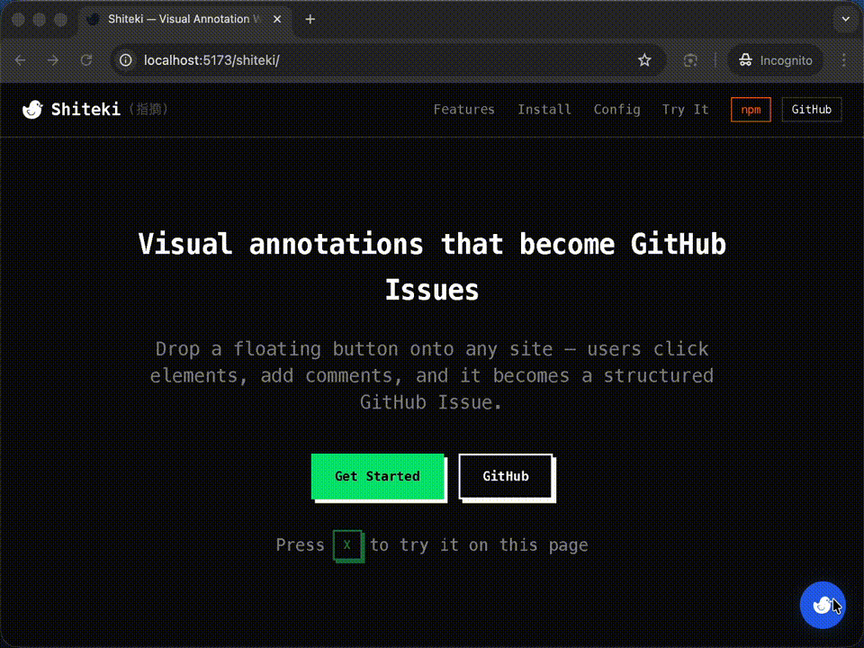

# Shiteki (指摘)

Web annotation widget that closes the feedback loop with AI. Click any element, add a comment — then either paste the structured prompt into Claude Code, or send it as a GitHub Issue for `/fix-issue` to handle automatically.



## How It Works

```
Click element → Add comment → Annotate more
                                    ↓
              ┌─────────────────────┴─────────────────────┐
              │                                           │
        Copy Prompt                              Send GitHub Issue
              │                                           │
   Paste into Claude Code                    Run /fix-issue in Claude Code
         terminal                            (or GitHub Action auto-triggers)
```

Each annotation captures the CSS selector, element context, and your comment — giving AI exactly what it needs to locate and fix the issue.

## Quick Start

```bash
npm install @taterboom/shiteki
```

```tsx
import { ShitekiWidget } from "@taterboom/shiteki";

<ShitekiWidget
  owner="your-github-username"
  repo="your-repo"
  endpoint="https://your-api.workers.dev"
/>
```

Or drop a single script tag (no build step):

```html
<script
  src="https://unpkg.com/@taterboom/shiteki/dist/standalone.global.js"
  data-shiteki='{"endpoint":"https://your-api.workers.dev","owner":"your-github-username","repo":"your-repo"}'
></script>
```
or
```html
<script
  src="https://unpkg.com/@taterboom/shiteki/dist/standalone.global.js"
  data-shiteki
></script>
```

## Two Workflows

### 1. Copy Prompt → Claude Code

Annotate the page, click **Copy** in the toolbar. You get a structured markdown prompt:

```markdown
# Visual Annotations

**Page:** [My App](https://myapp.com/dashboard)
**Annotations:** 2

---

## Annotation #1

**What should change:**
> The button text is cut off on mobile

**Element:**
- Tag: `<button>`
- Text: "Submit"
- Selector: `#checkout-form > button.submit-btn`
- Attributes: `class="submit-btn"`, `type="submit"`
```

Paste it into Claude Code and it can immediately locate the element and make the fix.

### 2. Send GitHub Issue → `/fix-issue`

Click **Send**, give the issue a title. Shiteki creates a structured GitHub Issue with the full annotation body.

Then in your project, run:

```
/fix-issue
```

Claude Code fetches the issue, reads the selectors and comments, finds the code, and opens a PR.

## Packages

| Package | Description |
|---------|-------------|
| [`@taterboom/shiteki`](packages/widget/) | React widget + standalone bundle ([npm](https://www.npmjs.com/package/@taterboom/shiteki)) |
| [`shiteki-api`](apps/api/) | Cloudflare Worker proxy for GitHub API |
| [`shiteki-demo`](apps/demo/) | Demo application |

## Development

```bash
pnpm install
pnpm build

# Start demo
pnpm dev:demo

# Develop widget with watch mode
pnpm dev:widget

# Start API locally
echo "GITHUB_TOKEN=ghp_xxxx" > apps/api/.dev.vars
pnpm dev:api
```

## License

MIT
